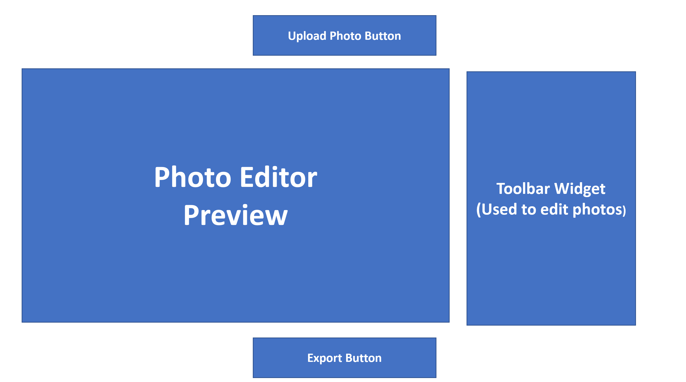

CS4241 Final Project Proposal
---

Group #: 21  
Group Members: Aditya Kumar, Matthew Malone, William White

## Project Idea

We want to create a website that will host a simple photo manipulation / editor tool. While there are websites and software that manipulate photos, we find majority of them to be too intricate or pricey to use. We believe that we can deliver a photo manipulation website that is accessible and simple to use.

Some simple photo manipulation features we'd like to include (given the deadline):
- Apply Filters 
- Add Text
- Crop / Morph 

If more time allows, we can add more features to make the website more robust.

## Libraries we can use to accomplish this:
- (insert something...)

## General Logic Flow for App

1) Client uploads a photo to edit via file select prompt
2) Website displays uploaded photo and toolbar widget
3) Client interacts with toolbar widget to manipulate the photo.
4) For each manipulation, the photo display will be updated to show a preview of the final product
5) Client is satisfied with manipulated photo, they click an "Export" button to download the final manipulated photo.

## Initial Website Mock-up

